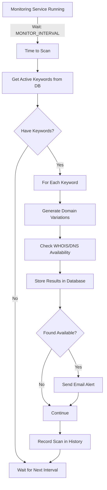

# Background Monitoring System - User Guide

How the 24/7 domain monitoring works and how to customize it.

---

## 🔄 How Background Monitoring Works

### When You Install the Application

1. **Application Launches**
   - Electron window opens (the user interface)
   - Python API server starts (port 5000)
   - **Monitor service AUTOMATICALLY starts in background**

2. **Monitoring Process**
   - Runs continuously in the background
   - Checks domains at regular intervals
   - Sends email alerts when domains become available
   - Runs even when you minimize or close the window

3. **System Tray**
   - Application sits in system tray (bottom-right on Windows)
   - Click the icon to see menu options
   - Can restart monitoring or quit completely

---

## 👀 How Users Know It's Running

### Visual Indicators

#### 1. System Tray Icon
- **Location**: Bottom-right corner of Windows taskbar
- **Icon**: Domain Monitor icon
- **Hover**: Shows "Domain Monitor" tooltip
- **Right-click**: Shows menu with options

#### 2. Application Window
- **Dashboard**: Shows last scan time
- **Scan History**: Lists all completed scans
- **Status**: Shows if monitoring is active

#### 3. Console Logs (For Advanced Users)
If you run from command line in development mode, you'll see:
```
[Python Monitor]: Domain Monitor Service Started
[Python Monitor]: Monitoring interval: 3600 seconds (60 minutes)
[Python Monitor]: Next scan in 3600 seconds...
```

### Where to Check Status

Open the application and look at:
- **Scan History Tab**: Shows recent  scans with timestamps
- **Dashboard**: Shows "Last Scan" time
- **Domains Tab**: Shows when domains were checked

---

## ⏰ Current Monitoring Interval

**Default: 3600 seconds = 1 hour** (NOT 6 hours!)

The documentation you saw mentioning 6 hours might have been outdated or referred to a different setting.

### Current Settings:
- **Default**: 1 hour (3600 seconds)
- **Configurable**: Yes, easily customizable
- **Minimum recommended**: 30 minutes (1800 seconds)
- **Maximum recommended**: 24 hours (86400 seconds)

---

## 🛠️ How to Change the Monitoring Interval

### Option 1: Edit .env File (Simplest)

**For Your Installation:**

1. Find your `.env` file:
   - **Development**: `d:\dms1\.env`
   - **Installed App**: `C:\Users\<YourName>\AppData\Roaming\domain-monitor\.env`

2. Open in text editor (Notepad)

3. Find this line:
   ```
   MONITOR_INTERVAL=3600
   ```

4. Change to desired interval in seconds:
   ```
   # Check every 30 minutes
   MONITOR_INTERVAL=1800
   
   # Check every 15 minutes
   MONITOR_INTERVAL=900
   
   # Check every 2 hours
   MONITOR_INTERVAL=7200
   
   # Check every 6 hours
   MONITOR_INTERVAL=21600
   ```

5. Save the file

6. **Restart the application** for changes to take effect

### Option 2: Users Can Copy & Edit

When users install your app, they can:

1. Navigate to: `C:\Users\<UserName>\AppData\Roaming\domain-monitor\`

2. If `.env` doesn't exist, copy `.env.example` and rename to `.env`

3. Edit `MONITOR_INTERVAL` to desired value

4. Restart application

---

## 📊 Recommended Intervals

| Use Case | Interval | Seconds | Reason |
|----------|----------|---------|--------|
| **Aggressive** | 15 minutes | 900 | Catch domains quickly |
| **Standard** | 30 minutes | 1800 | Good balance |
| **Balanced** | 1 hour | 3600 | **Current default** |
| **Conservative** | 2 hours | 7200 | Reduce API load |
| **Light** | 6 hours | 21600 | Very light monitoring |
| **Daily** | 24 hours | 86400 | Once per day |

### ⚠️ Considerations

**Shorter intervals (15-30 min):**
- ✅ Catch domains faster
- ✅ More responsive
- ❌ More WHOIS queries (may hit rate limits)
- ❌ More CPU/network usage

**Longer intervals (2-6 hours):**
- ✅ Less resource usage
- ✅ Lower chance of rate limiting
- ❌ Slower domain detection
- ❌ Might miss domains

---

## 🎯 How to Reduce Interval to 30 Minutes

### For Your Installation:

**Quick Command:**

```powershell
# Navigate to project
cd d:\dms1

# Update .env file
(Get-Content .env) -replace 'MONITOR_INTERVAL=3600', 'MONITOR_INTERVAL=1800' | Set-Content .env
```

**Manual Edit:**

1. Open `d:\dms1\.env`
2. Change line 11 to:
   ```
   MONITOR_INTERVAL=1800
   ```
3. Save
4. Restart app

### For End Users:

Add this to your documentation:

```markdown
## How to Change Monitoring Frequency

1. Close Domain Monitor application
2. Press Windows+R, type: `%APPDATA%\domain-monitor`
3. Open `.env` file in Notepad
4. Find `MONITOR_INTERVAL=3600`
5. Change to desired interval:
   - 30 minutes: `MONITOR_INTERVAL=1800`
   - 15 minutes: `MONITOR_INTERVAL=900`
6. Save and restart application
```

---

## 🔍 What Happens During Each Scan



### Step by Step:

1. **Wait**: Sleep for `MONITOR_INTERVAL` seconds
2. **Fetch**: Get all keywords from database
3. **Generate**: Create domain variations (.com, .net, etc.)
4. **Check**: Query WHOIS for each domain
5. **Store**: Save availability status to database
6. **Notify**: Send email for newly available domains
7. **Repeat**: Go back to step 1

---

## 💡 System Tray Menu Options

Right-click the tray icon to see:

```
┌─────────────────────────────┐
│ Show Domain Monitor         │ ← Open main window
│ Open in Browser             │ ← Open in default browser
├─────────────────────────────┤
│ Restart Monitoring          │ ← Restart background service
├─────────────────────────────┤
│ Quit                        │ ← Stop everything and quit
└─────────────────────────────┘
```

**"Restart Monitoring"** - Use if:
- You changed `.env` settings
- Monitoring seems stuck
- Want to force an immediate scan

---

## 📱 Desktop Notifications (Future Enhancement)

Currently, users are notified via:
- ✅ Email alerts
- ✅ Scan history in app
- ✅ Domain list updated

**Future**: Add Windows toast notifications
```javascript
// In electron/main.js
const { Notification } = require('electron');
new Notification({
  title: 'Domain Available!',
  body: 'example.com is now available'
}).show();
```

---

## 🔧 Advanced: Custom Monitoring Logic

### If Users Want More Control

The monitoring service is in: `backend/monitor_service.py`

**Current logic** (line 97-110):
```python
def run_continuous(self):
    while True:
        self.run_scan()  # Do one scan
        
        logger.info(f"\nNext scan in {self.interval} seconds...")
        time.sleep(self.interval)  # Wait
```

**Potential customizations:**
- Scan only during business hours
- Different intervals for different keywords
- Skip weekends
- Adaptive interval based on results

---

## 🎮 For End Users: Quick Guide

### How to Know Monitoring Is Active

1. **Check System Tray**
   - Look for Domain Monitor icon (bottom-right)
   - Hover to see "Domain Monitor"

2. **Check Scan History**
   - Open application
   - Go to "Scan History" tab
   - See recent scans with timestamps

3. **Check Last Scan Time**
   - Dashboard shows "Last Scan: X minutes ago"

### How to Change Scan Frequency

1. Close application
2. Open: `%APPDATA%\domain-monitor\.env`
3. Edit: `MONITOR_INTERVAL=1800` (30 min)
4. Save and restart

### Troubleshooting: Monitoring Not Running

**Check if service is active:**
1. Open application
2. Look at scan history
3. If no recent scans: Right-click tray → "Restart Monitoring"

**If still not working:**
1. Quit completely (Right-click tray → Quit)
2. Restart application
3. Check logs in: `%APPDATA%\domain-monitor\logs`

---

## 📖 Default Behavior Summary

| Aspect | Behavior |
|--------|----------|
| **Auto-start** | ✅ Starts with application |
| **Background** | ✅ Runs even when window closed |
| **Visible** | ✅ Icon in system tray |
| **Logs** | ✅ Saved to app data folder |
| **Interval** | 1 hour (3600 seconds) |
| **Configurable** | ✅ Via .env file |
| **Restart** | Via tray menu |
| **Email** | ✅ Sends on new domains |

---

## 🎯 Quick Reference Commands

### Check Current Interval
```powershell
# In your .env file
findstr MONITOR_INTERVAL d:\dms1\.env
```

### Change to 30 Minutes
```powershell
# Backup first
copy d:\dms1\.env d:\dms1\.env.backup

# Update
(Get-Content d:\dms1\.env) -replace 'MONITOR_INTERVAL=.*', 'MONITOR_INTERVAL=1800' | Set-Content d:\dms1\.env
```

### Change to 15 Minutes
```powershell
(Get-Content d:\dms1\.env) -replace 'MONITOR_INTERVAL=.*', 'MONITOR_INTERVAL=900' | Set-Content d:\dms1\.env
```

---

## 🚀 Recommendation for Your Project

For best user experience:

1. **Update .env.example** to 30 minutes (1800):
   ```
   MONITOR_INTERVAL=1800
   ```

2. **Add to README**:
   ```markdown
   ## Monitoring Frequency
   
   By default, domains are checked every 30 minutes.
   
   To customize: Edit MONITOR_INTERVAL in .env file.
   ```

3. **Add to UI** (future enhancement):
   - Settings page in web interface
   - Dropdown: 15 min, 30 min, 1 hour, 6 hours
   - Saves to database and updates .env

---

**Want me to update the default interval to 30 minutes or another value?**
