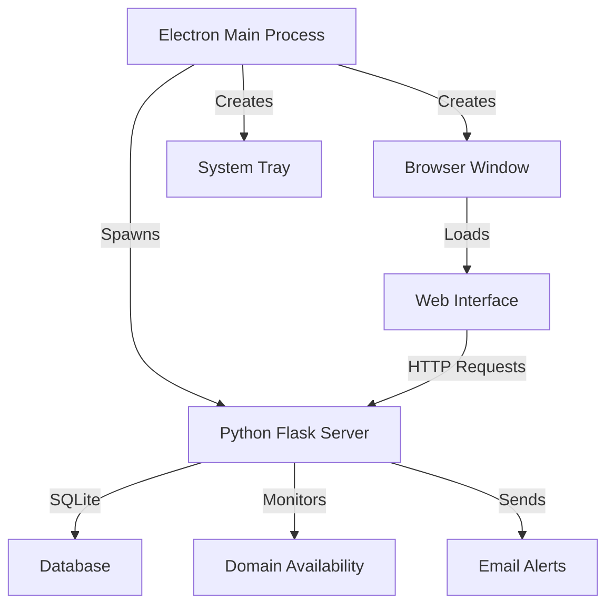

# Packaging Architecture

Technical documentation for Domain Monitor's packaging and distribution strategy.

---

## Architecture Overview

Domain Monitor uses a hybrid architecture combining:
- **Electron** - Cross-platform desktop framework
- **Python/Flask** - Backend API server
- **HTML/CSS/JS** - Frontend web interface



---

## Component Breakdown

### 1. Electron Layer

**Purpose**: Native desktop application wrapper

**Files**:
- `electron/main.js` - Main process (Node.js)
- `electron/preload.js` - Security bridge
- `package.json` - Dependencies and build config

**Responsibilities**:
- Start/stop Python backend
- Create application window
- Manage system tray
- Handle app lifecycle
- Provide native OS integration

### 2. Python Backend

**Purpose**: Business logic and domain monitoring

**Files**:
- `backend/api.py` - Flask REST API
- `backend/monitor_service.py` - Background monitoring
- `backend/domain_checker.py` - Domain availability logic
- `backend/database.py` - SQLite operations
- `backend/email_notifier.py` - Email alerts

**Bundling Strategy**:
- Use PyInstaller to create standalone Python distribution
- Include all dependencies (Flask, python-whois, dnspython)
- Bundle as separate directory (not single file for easier debugging)
- Platform-specific Python executables

### 3. Frontend

**Purpose**: User interface

**Files**:
- `frontend/index.html` - UI structure
- `frontend/style.css` - Styling
- `frontend/script.js` - Interactions

**Integration**:
- Served by Flask on localhost:5000
- Loaded in Electron BrowserWindow
- No modifications needed for packaging

---

## Build Process Flow

```mermaid
flowchart TD
    Start[Start Build] --> InstallDeps[npm install]
    InstallDeps --> BundlePython[Bundle Python Backend]
    BundlePython --> PyInstaller{PyInstaller Available?}
    PyInstaller -->|Yes| CreateStandalone[Create Standalone Python]
    PyInstaller -->|No| CopyFiles[Copy Python Files]
    CreateStandalone --> ElectronBuilder[Run Electron Builder]
    CopyFiles --> ElectronBuilder
    ElectronBuilder --> Platform{Target Platform?}
    Platform -->|Windows| WinBuild[Build NSIS + Portable]
    Platform -->|macOS| MacDeploy Build DMG + ZIP]
    Platform -->|Linux| LinuxBuild[Build AppImage + deb + rpm]
    WinBuild --> Output[dist-electron/]
    MacDeploy --> Output
    LinuxBuild --> Output
```

---

## Packaging Components

### Python Distribution

#### Windows
```
python-dist/
└── domain-monitor-backend/
    ├── python.exe
    ├── python38.dll
    ├── _internal/
    │   ├── Flask/
    │   ├── werkzeug/
    │   ├── whois/
    │   └── ... (all dependencies)
    ├── backend/
    │   ├── api.py
    │   ├── monitor_service.py
    │   └── ...
    └── requirements.txt
```

#### macOS/Linux
```
python-dist/
└── domain-monitor-backend/
    ├── domain-monitor-backend (executable)
    ├── _internal/
    │   └── ... (bundled dependencies)
    └── backend/
        └── ...
```

### Electron Application

#### Application Structure (Installed)
```
Domain Monitor/
├── Domain Monitor.exe (Windows) / Domain Monitor.app (macOS)
├── resources/
│   ├── app.asar (Electron code)
│   ├── python/ (Python distribution)
│   ├── backend/ (Python source)
│   ├── frontend/ (Web interface)
│   └── data/ (Database directory)
└── locales/, swiftshader/, etc. (Chromium runtime)
```

---

## Platform-Specific Packaging

### Windows (NSIS Installer)

**Build Configuration**:
```json
{
  "win": {
    "target": ["nsis", "portable"],
    "icon": "resources/icon.ico"
  },
  "nsis": {
    "oneClick": false,
    "allowToChangeInstallationDirectory": true,
    "createDesktopShortcut": true,
    "createStartMenuShortcut": true
  }
}
```

**Installer Actions**:
1. Extract application files to Program Files
2. Create Start Menu shortcut
3. Create Desktop shortcut (optional)
4. Register uninstaller
5. Add to Add/Remove Programs

**Runtime Behavior**:
- Electron starts (`Domain Monitor.exe`)
- `main.js` spawns `python/python.exe backend/api.py`
- Flask server starts on port 5000
- Electron window loads `http://localhost:5000`

### macOS (DMG)

**Build Configuration**:
```json
{
  "mac": {
    "target": ["dmg", "zip"],
    "icon": "resources/icon.icns",
    "category": "public.app-category.developer-tools"
  }
}
```

**DMG Contents**:
- `Domain Monitor.app` - Application bundle
- Background image with drag-to-Applications instruction
- Symbolic link to /Applications folder

**App Bundle Structure**:
```
Domain Monitor.app/
└── Contents/
    ├── Info.plist
    ├── MacOS/
    │   └── Domain Monitor (executable)
    ├── Resources/
    │   ├── electron.asar
    │   ├── python/ (Python distribution)
    │   ├── backend/
    │   └── icon.icns
    └── Frameworks/ (Electron framework)
```

### Linux (AppImage, deb, rpm)

**Build Configuration**:
```json
{
  "linux": {
    "target": ["AppImage", "deb", "rpm"],
    "icon": "resources/icon.png",
    "category": "Development"
  }
}
```

**AppImage** (Recommended):
- Self-contained executable
- No installation required
- Works on most Linux distributions
- Single file distribution

**Structure**:
```
Domain-Monitor-1.0.0.AppImage
├── AppRun (launcher script)
├── domain-monitor.desktop
├── icon.png
└── usr/
    ├── bin/domain-monitor
    ├── lib/
    │   └── ... (app files)
    └── share/
```

---

## Resource Management

### File Inclusion

**Included in Build**:
- ✅ `electron/` - Electron code
- ✅ `backend/` - Python source
- ✅ `frontend/` - Web UI
- ✅ `resources/` - Icons, assets
- ✅ `.env.example` - Config template
- ✅ `sample_keywords.csv` - Sample data

**Excluded**:
- ❌ `node_modules/` (bundled differently)
- ❌ `venv/` - Not needed (Python bundled)
- ❌ `__pycache__/`, `*.pyc` - Compiled files
- ❌ `data/*.db` - User data (created on first run)
- ❌ `.git/` - Version control

### Resource Paths

**Development**:
```javascript
// Relative to project root
const backendPath = path.join(__dirname, '..', 'backend');
const resourcesPath = path.join(__dirname, '..', 'resources');
```

**Production**:
```javascript
// Relative to app resources
const backendPath = path.join(process.resourcesPath, 'backend');
const resourcesPath = path.join(process.resourcesPath, 'resources');
```

**Detection**:
```javascript
const isDev = !app.isPackaged;
```

---

## Data Persistence

### Database Location

**Development**:
```
d:\dms1\data\domains.db
```

**Production**:
```
# Windows
C:\Users\USERNAME\AppData\Roaming\domain-monitor\data\domains.db

# macOS
~/Library/Application Support/domain-monitor/data/domains.db

# Linux
~/.config/domain-monitor/data/domains.db
```

**Configuration**:
```javascript
// In electron/main.js
const dataPath = app.getPath('userData');
process.env.DATA_DIR = path.join(dataPath, 'data');
```

### Configuration Files

**.env file**:
- Created from `.env.example` on first run
- Stored in user data directory
- Persists across updates

---

## Security Considerations

### Context Isolation

**Enabled** (`electron/preload.js`):
```javascript
contextBridge.exposeInMainWorld('electronAPI', {
  // Only expose specific, safe APIs
  getVersion: () => ipcRenderer.invoke('get-version'),
  showNotification: (title, body) => 
    ipcRenderer.invoke('show-notification', title, body)
});
```

**Why**: Prevents web content from accessing Node.js APIs directly

### Node Integration

**Disabled** in renderer:
```javascript
webPreferences: {
  nodeIntegration: false,
  contextIsolation: true
}
```

**Why**: Web content runs in sandboxed environment

### Content Security Policy

**Future Enhancement**:
```javascript
session.defaultSession.webRequest.onHeadersReceived((details, callback) => {
  callback({
    responseHeaders: {
      'Content-Security-Policy': ["default-src 'self'"]
    }
  });
});
```

---

## Update Mechanism

### Auto-Update Support

Electron Builder includes auto-update functionality:

**Configuration**:
```json
{
  "publish": {
    "provider": "github",
    "owner": "your-username",
    "repo": "domain-monitor"
  }
}
```

**Implementation** (`electron/main.js`):
```javascript
const { autoUpdater } = require('electron-updater');

app.on('ready', () => {
  autoUpdater.checkForUpdatesAndNotify();
});

autoUpdater.on('update-downloaded', () => {
  // Notify user
  // Prompt to restart
});
```

**Update Process**:
1. Check GitHub releases for new version
2. Download update in background
3. Verify signature
4. Prompt user to restart
5. Install on next launch

---

## Performance Optimization

### Startup Time

**Current**: ~5-10 seconds
- Electron init: ~2s
- Python startup: ~3s
- Flask ready: ~2s
- UI load: ~1s

**Optimizations**:
1. **Lazy load monitoring service** - Don't start immediately
2. **Preload Python** - Keep process warm
3. **Cache static assets** - Faster UI load
4. **Use ASAR archive** - Faster file access

### Memory Usage

**Typical**:
- Electron (Chromium): ~100MB
- Node.js: ~30MB
- Python: ~50MB
- Flask: ~30MB
**Total**: ~210MB

**Optimizations**:
1. **Limit Chromium processes** - Disable unnecessary features
2. **Use SQLite efficiently** - Connection pooling
3. **Garbage collection** - Manual GC triggers

### Bundle Size

**Without optimization**: ~250MB installed

**With optimization**:
- Exclude dev dependencies: -20MB
- Compress ASAR: -10MB
- Optimize Python bundle: -30MB
**Total**: ~190MB

---

## Distribution Channels

### 1. Direct Download

**Pros**:
- Full control
- No approval process
- Immediate updates

**Cons**:
- Manual hosting required
- No update infrastructure
- Limited discoverability

### 2. GitHub Releases

**Pros**:
- Free hosting
- Built-in update server
- Version management

**Cons**:
- Public only (unless paid)
- Download limits (bandwidth)

**Setup**:
```bash
# Create release
gh release create v1.0.0 \
  dist-electron/Domain-Monitor-Setup-1.0.0.exe \
  dist-electron/Domain-Monitor-1.0.0.dmg \
  dist-electron/Domain-Monitor-1.0.0.AppImage
```

### 3. Package Managers

#### Windows (Winget)
```yaml
# domain-monitor.yaml
PackageIdentifier: DomainMonitor.DomainMonitor
PackageVersion: 1.0.0
PackageLocale: en-US
Publisher: Domain Monitor Team
PackageName: Domain Monitor
License: MIT
ShortDescription: Track domain availability
Installers:
  - InstallerUrl: https://example.com/Domain-Monitor-Setup-1.0.0.exe
    InstallerSha256: <hash>
```

#### macOS (Homebrew)
```ruby
cask "domain-monitor" do
  version "1.0.0"
  sha256 "<hash>"
  url "https://github.com/user/domain-monitor/releases/download/v#{version}/Domain-Monitor-#{version}.dmg"
  name "Domain Monitor"
  desc "Track domain availability"
  app "Domain Monitor.app"
end
```

#### Linux (Snap)
```yaml
name: domain-monitor
version: '1.0.0'
summary: Track domain availability
description: |
  Domain monitoring system
grade: stable
confinement: strict
apps:
  domain-monitor:
    command: domain-monitor
    plugs: [network, home]
```

---

## Debugging Packaged App

### Enable DevTools in Production

```javascript
// electron/main.js
if (process.argv.includes('--debug')) {
  mainWindow.webContents.openDevTools();
}
```

Run with:
```bash
"Domain Monitor.exe" --debug
```

### View Logs

**Windows**:
```
%APPDATA%\domain-monitor\logs\
```

**macOS**:
```
~/Library/Logs/domain-monitor/
```

**Linux**:
```
~/.config/domain-monitor/logs/
```

### Common Issues

1. **Python not found**: Check `process.resourcesPath/python`
2. **Port conflict**: Change API_PORT in main.js
3. **Database locked**: Check file permissions
4. **CORS errors**: Verify Flask CORS config

---

## Future Enhancements

### Planned Features

1. **Auto-updates** - Automatic download and install
2. **Multi-language** - i18n support
3. **Themes** - Dark/light mode
4. **Native notifications** - OS-level alerts
5. **Tray menu** - Quick actions
6. **Crash reporting** - Sentry integration
7. **Analytics** - Usage tracking (opt-in)

### Technical Improvements

1. **Code signing** - Certificates for all platforms
2. **Notarization** - macOS Gatekeeper approval
3. **Sandboxing** - Enhanced security
4. **Performance monitoring** - Track metrics
5. **Bundle optimization** - Smaller package sizes

---

**For build instructions, see [BUILD_GUIDE.md](BUILD_GUIDE.md)**
