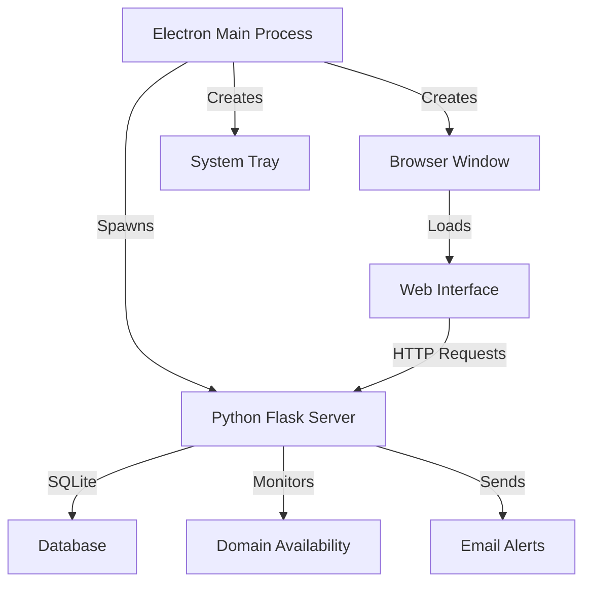

# Domain Monitor

**Professional domain monitoring system** - Track domain availability and get instant email alerts when domains become available.

[](LICENSE)
[](https://github.com/YOUR-GITHUB-USERNAME/domain-monitor/releases)

---

## 📥 Download

**Latest Release**: [v1.0.0](https://github.com/YOUR-GITHUB-USERNAME/domain-monitor/releases/latest)

### Windows
- **Installer**: [Domain-Monitoring-System-Setup-1.0.0.exe](https://github.com/YOUR-GITHUB-USERNAME/domain-monitor/releases/latest)
- **Requirements**: Windows 10/11 (64-bit), 4 GB RAM

---

## ✨ Features

- 🔍 **Domain Monitoring** - Automatically check domain availability
- 📧 **Email Alerts** - Get notified when monitored domains become available
- 🎯 **Keyword Generation** - Generate domain variations from keywords
- 📊 **CSV Import/Export** - Bulk import keywords and export results
- 💾 **SQLite Database** - Efficient local data storage
- ⚙️ **Background Service** - Continuous monitoring even when minimized
- 🌐 **Multiple TLDs** - Support for .com, .net, .org, .io, and more
- 🖥️ **System Tray** - Runs quietly in the background

---

## 🚀 Quick Start

### Installation

1. **Download** the installer from [Releases](https://github.com/YOUR-GITHUB-USERNAME/domain-monitor/releases/latest)
2. **Run** `Domain-Monitoring-System-Setup-1.0.0.exe`
3. **Follow** the installation wizard
4. **Launch** from Desktop shortcut or Start Menu

> [!NOTE]
> Windows may show a security warning because the app isn't code-signed. Click "More info" → "Run anyway" to proceed safely.

### First Run

1. **Configure Email** (optional):
   - Settings → Email Configuration
   - Enter SMTP details for notifications

2. **Add Keywords**:
   - Enter keywords manually, or
   - Import from CSV file

3. **Start Monitoring**:
   - Click "Start Scan"
   - Monitor runs in background

---

## 📖 Documentation

- **[Build Guide](BUILD_GUIDE.md)** - How to build from source
- **[Distribution Guide](DISTRIBUTION_GUIDE.md)** - How to distribute the application
- **[GitHub Release Guide](GITHUB_RELEASE_GUIDE.md)** - How to publish releases
- **[Packaging Architecture](PACKAGING.md)** - Technical packaging details
- **[Tech Stack](TECH_STACK.md)** - Technologies used
- **[Project Documentation](PROJECT_DOCUMENTATION.md)** - Complete project overview

---

## 🛠️ For Developers

### Prerequisites

- Node.js 18+ and npm
- Python 3.8+
- Git

### Development Setup

```bash
# Clone repository
git clone https://github.com/YOUR-GITHUB-USERNAME/domain-monitor.git
cd domain-monitor

# Install dependencies
npm install
pip install -r requirements.txt

# Run in development mode
npm run dev
```

### Build from Source

```bash
# Windows
npm run build:win

# Output: dist-electron/Domain-Monitoring-System-Setup-1.0.0.exe
```

See [BUILD_GUIDE.md](BUILD_GUIDE.md) for detailed instructions.

---

## 🏗️ Architecture



**Tech Stack**:
- **Frontend**: HTML5, CSS3, JavaScript
- **Desktop**: Electron 28
- **Backend**: Python 3.8, Flask
- **Database**: SQLite3
- **Domain Checking**: python-whois, dnspython

See [TECH_STACK.md](TECH_STACK.md) for details.

---

## 📋 System Requirements

### Windows
- OS: Windows 10/11 (64-bit)
- RAM: 4 GB minimum, 8 GB recommended
- Disk: 500 MB free space
- Network: Active internet connection

### macOS (Coming Soon)
- OS: macOS 10.15 (Catalina) or later
- RAM: 4 GB minimum
- Disk: 500 MB free space

### Linux (Coming Soon)
- OS: Ubuntu 20.04+, Fedora 35+, or compatible
- RAM: 4 GB minimum
- Disk: 500 MB free space

---

## 🤝 Contributing

Contributions are welcome! Please:

1. Fork the repository
2. Create a feature branch (`git checkout -b feature/amazing-feature`)
3. Commit your changes (`git commit -m 'Add amazing feature'`)
4. Push to branch (`git push origin feature/amazing-feature`)
5. Open a Pull Request

---

## 🐛 Bug Reports & Feature Requests

Found a bug or have a feature idea?

- **Issues**: [Create an issue](https://github.com/YOUR-GITHUB-USERNAME/domain-monitor/issues/new)
- **Email**: your-email@example.com

---

## 📜 License

This project is licensed under the MIT License - see [LICENSE](LICENSE) file for details.

---

## 🔄 Updates

This application supports **automatic updates**! When a new version is released, you'll be notified and can update with one click.

### Manual Updates
1. Download latest version from [Releases](https://github.com/YOUR-GITHUB-USERNAME/domain-monitor/releases/latest)
2. Run the new installer
3. Your data and settings will be preserved

---

## 📞 Support

- **Documentation**: Check the docs folder
- **Issues**: [GitHub Issues](https://github.com/YOUR-GITHUB-USERNAME/domain-monitor/issues)
- **Email**: your-email@example.com

---

## 🙏 Acknowledgments

- Built with [Electron](https://www.electronjs.org/)
- Backend powered by [Flask](https://flask.palletsprojects.com/)
- Domain checking via [python-whois](https://pypi.org/project/python-whois/)

---

## 📸 Screenshots

[Add screenshots of your application here]

---

**Made with ❤️ for domain enthusiasts**
